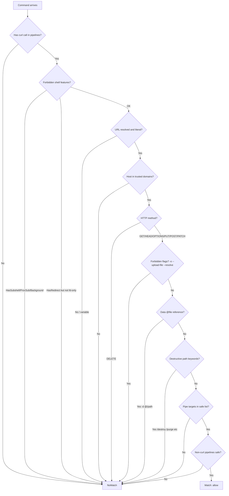

# Task: CurlToDomain tier 2 allow rule

**Created:** 2026-04-21
**Status:** Planning
**Context:** curl PUT/POST/PATCH to studio.taufinity.io prompts every time because the LLM tier (Gemini) classifies all write-method curl commands as "unsafe: external API call with side effects." Since tier 4 is approve-only and the "unsafe" verdict is never cached as allow, the user is prompted on every invocation. Need a deterministic tier 2 rule to auto-allow curl to trusted domains for non-destructive operations.

## Design

### Rule: `CurlToDomain`

A new tier 2 rule type that allows curl commands targeting trusted API domains, distinguishing between safe mutations (PUT/POST/PATCH) and destructive actions (DELETE).

**Safety model:**
- GET, HEAD, OPTIONS → always allow (reads)
- PUT, POST, PATCH → allow (mutations are normal operational work)
- DELETE → fall through to prompt (destructive, let human confirm)
- Destructive URL path keywords (`/destroy`, `/purge`, `/truncate`, `/drop`, `/wipe`) → fall through regardless of method

**Structural requirements:**
- Program must be `curl`
- At least one positional arg must be a **resolved** URL with host matching a trusted domain
- URL itself must NOT be from a variable (can't verify domain of `$URL`)
- `$TOKEN`/`$VARIABLE` in headers/body is fine — those are unresolved args, not the URL
- Tolerates compound commands: `TOKEN=$(cmd) && curl ...`, `curl ... | jq .`
- Pipe targets must be in existing `safePipeTargets` list from defaults.go (jq, head, tail, grep, etc. — NO interpreters like python3/bash)
- Non-curl pipelines in compound must be either assignments (no Program) or safe read-only commands
- Rejects `HasSubshell`, `HasProcSub`, `HasBackground` (same as existing compound rules)
- Rejects `HasRedirect` unless `HasFdOnlyRedirects` (same pattern as PipelineReadonly — blocks `> /etc/hosts` but allows `2>&1`)
- Allows `HasCmdSub` (needed for `TOKEN=$(...)`) and `HasBinaryOp`/`HasMultiStmt`/`HasPipe`

**Forbidden curl flags (file write / connection hijack):**
- `-o`, `--output` — writes response to arbitrary file (local file overwrite)
- `--upload-file`, `-T` — pure file-upload flags (exfiltration risk)
- `--resolve`, `--connect-to` — hijacks connection to different host while URL looks trusted

**Data argument safety:**
- `-d @/path`, `--data @/path`, `--data-binary @/path`, `--data-raw @/path`, `--data-urlencode @/path` — when value starts with `@`, it reads a local file. Reject if `@`-prefixed (fall through to prompt). Plain `-d '{"json": ...}'` without `@` is fine.

**Configured trusted domains (initial):**
- `studio.taufinity.io`

### Flow diagram

## Plan

1. [x] Research: understand existing rule patterns, parser output, compound command handling
2. [ ] Add `CurlToDomain` rule type in `internal/rules/curl_domain.go` (new file, follows pattern of other rules)
3. [ ] Helpers in same file: `curlMethod(args)`, `curlURL(positional)`, `curlHasForbiddenFlags(args)`, `curlHasFileData(args)`
4. [ ] Register rule in `internal/config/defaults.go` with trusted domains, integrate with safePipeTargets
5. [ ] Add test cases to `internal/corpus/testdata/bash_allow.txt`
6. [ ] Add test cases to `internal/corpus/testdata/bash_continue.txt`
7. [ ] Add adversarial cases to `internal/corpus/testdata/bash_adversarial.txt`
8. [ ] Run `make test` — all golden corpus + unit tests pass
9. [ ] Run `make install`
10. [ ] Verify with `claude-guard test`

## Failure Routing

| Phase | On Failure → Route To |
|---|---|
| Step 2-3 (rule code) | Fix compilation errors, re-check rule interface |
| Step 4 (registration) | Verify import, check rule is in allow list |
| Step 5-7 (test data) | Fix test case format, verify expected verdict |
| Step 8 (tests) | Debug failing cases, adjust rule logic |
| Step 9-10 (install/verify) | Check build, fix compilation |

## Files Modified

- `internal/rules/curl_domain.go` — new CurlToDomain rule type + helpers (NEW)
- `internal/config/defaults.go` — register rule in DefaultAllowRules
- `internal/corpus/testdata/bash_allow.txt` — positive test cases
- `internal/corpus/testdata/bash_continue.txt` — non-matching cases
- `internal/corpus/testdata/bash_adversarial.txt` — bypass attempts
