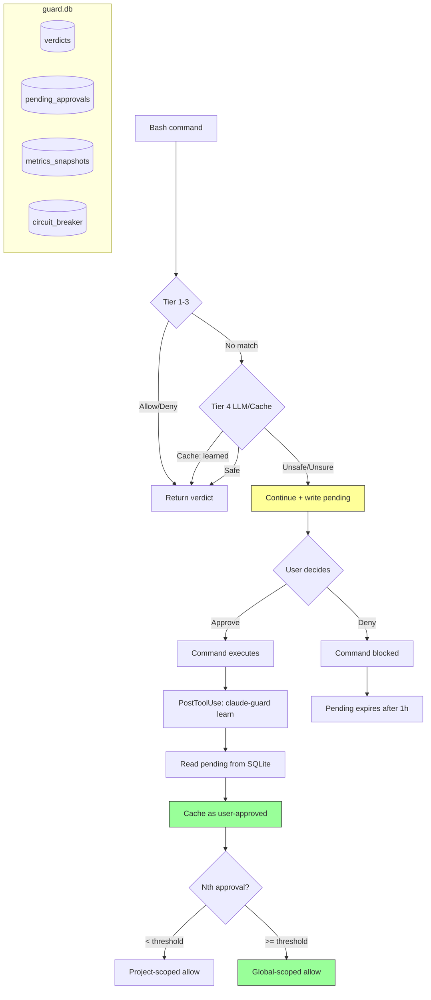

# Task: Self-Learning Guard + Flow Metrics + SQLite Storage + Web Dashboard

**Created:** 2026-04-21
**Status:** Planning
**Context:** The guard forwards verifier disagreements to the user (Continue), but never learns from user approvals. The same command gets prompted every time. Additionally, there's no visibility into how much the guard interrupts the developer flow. Finally, the file-per-key cache (2500+ files across 256 shards) should migrate to SQLite for better performance, atomicity, and to enable persistent metrics history.

## Problem

### Self-learning
When the guard returns `Continue` (prompt user) and the user approves, the command executes via PostToolUse. But the guard never sees this feedback — next time the same command appears, it prompts again. Friction for commands the user has already approved.

### Flow metrics
No visibility into how often/long humans are interrupted, how much auto-approval saves, or how the guard's effectiveness evolves over time.

### File-per-key cache limitations
- 2500+ small JSON files across 256 shards
- No transactional updates (race on read-modify-write for MatchCount)
- No built-in expiry sweep (manual walk required)
- No historical metrics (current state only, no time series)
- Pending approvals, circuit breaker, learned patterns all need separate file management

## Design

### SQLite as single storage layer

**Location:** `~/.cache/claude-guard/guard.db`

**Tables:**

```sql
-- Replaces file-per-key verdict cache
CREATE TABLE verdicts (
    key TEXT PRIMARY KEY,
    command TEXT,
    canonical_form TEXT,
    program TEXT,
    cwd TEXT,
    verdict TEXT NOT NULL,         -- 'allow' | 'deny'
    effective_verdict TEXT,        -- after verifier override
    tier TEXT,
    reason TEXT,
    provider TEXT,
    model TEXT,
    stored_at TEXT NOT NULL,
    expires_at TEXT,
    verified INTEGER DEFAULT 0,
    verified_at TEXT,
    verifier_provider TEXT,
    verifier_model TEXT,
    verifier_verdict TEXT,
    verifier_reason TEXT,
    disagreement INTEGER DEFAULT 0,
    trusted_at TEXT,
    trusted_reason TEXT,
    match_count INTEGER DEFAULT 0,
    approval_count INTEGER DEFAULT 0  -- for learned entries
);
CREATE INDEX idx_verdicts_program ON verdicts(program);
CREATE INDEX idx_verdicts_expires ON verdicts(expires_at);
CREATE INDEX idx_verdicts_canonical ON verdicts(canonical_form) WHERE canonical_form != '';

-- Pending approvals (PreToolUse Continue → waiting for PostToolUse)
CREATE TABLE pending_approvals (
    tool_use_id TEXT PRIMARY KEY,
    command TEXT NOT NULL,
    canonical_form TEXT,
    cwd TEXT,
    session_id TEXT,
    prompted_at TEXT NOT NULL,
    reason TEXT
);
CREATE INDEX idx_pending_age ON pending_approvals(prompted_at);

-- Circuit breaker state (replaces llm-circuit.json)
CREATE TABLE circuit_breaker (
    id INTEGER PRIMARY KEY CHECK (id = 1),  -- singleton
    state TEXT NOT NULL,                      -- 'closed' | 'open'
    opened_at TEXT,
    reason TEXT,
    failure_count INTEGER DEFAULT 0
);

-- Metrics history (NEW — persistent time series)
CREATE TABLE metrics_snapshots (
    id INTEGER PRIMARY KEY AUTOINCREMENT,
    recorded_at TEXT NOT NULL,
    period_hours INTEGER NOT NULL,           -- lookback window
    total_decisions INTEGER,
    allow_count INTEGER,
    continue_count INTEGER,
    deny_count INTEGER,
    tier1_block INTEGER,
    tier2_allow INTEGER,
    cache_hits INTEGER,
    llm_calls INTEGER,
    legacy_hits INTEGER,
    learned_allows INTEGER,
    stop_hook_evals INTEGER,
    stop_hook_fires INTEGER,
    interrupts INTEGER,                      -- Continue verdicts (user prompted)
    user_approved INTEGER,                   -- learned from PostToolUse
    user_unanswered INTEGER,                     -- Continue without PostToolUse
    median_uninterrupted_s REAL,             -- seconds between prompts
    p95_uninterrupted_s REAL,
    max_uninterrupted_s REAL,
    cache_entries INTEGER,
    cache_size_bytes INTEGER,
    learned_patterns INTEGER
);
CREATE INDEX idx_metrics_time ON metrics_snapshots(recorded_at);
```

**Why SQLite:**
- Single file vs. 2500+ files — simpler backup, faster operations
- Atomic transactions — no race conditions on read-modify-write
- Expiry via `DELETE WHERE expires_at < datetime('now')` — no directory walk
- Metrics history is just `INSERT INTO metrics_snapshots`
- WAL mode for concurrent reads during writes (hook invocations are short)
- Go stdlib `database/sql` + `modernc.org/sqlite` (pure Go, no CGO)

### Self-Learning via PostToolUse Hook

**PostToolUse hook** calls `claude-guard learn`:
1. Receive PostToolUse JSON on stdin
2. Look up `pending_approvals` by `tool_use_id`
3. If found → user approved → insert/update `verdicts` with `tier=learned`
4. Increment `approval_count` on canonical match
5. After N approvals (default 3) → promote to global scope
6. Delete the pending row

**PreToolUse** writes pending row:
- When verdict is `Continue` → `INSERT INTO pending_approvals`
- Stale cleanup: `DELETE WHERE prompted_at < datetime('now', '-1 hour')`

### Flow Metrics

**Snapshot recording:**
- `claude-guard stats --record` writes a metrics_snapshots row
- Can be called from a cron or at end of session
- `claude-guard stats --history` shows trend over time

**Stats output additions:**
```
flow metrics (last 24h):
  uninterrupted stretches:
    median:  12m 30s
    p95:     45m 00s
    longest: 2h 15m
  human interrupts:      42 (user-approved: 38, denied: 4)
  stop hook continues:   36 / 490 evals (7.3%)
  learned patterns:      15 (auto-allows from learning: 230)

trend (last 7 days):
  date        interrupts  learned  auto-allow%
  2026-04-15       85        0       72.3%
  2026-04-16       63        5       78.1%
  2026-04-17       42       12       85.4%
  2026-04-18       31       15       89.2%
  ...
```

## Plan

**Phasing:** Phase 0 (SQLite) + Phase 1 (learning) are one PR — the foundation everything depends on. Phase 2 (metrics) + Phase 3 (tests) + Phase 4 (dashboard) are a follow-up PR. Binary size will increase ~8-10MB from pure-Go SQLite (`modernc.org/sqlite`).

### Phase 0: SQLite foundation

1. [ ] Add `modernc.org/sqlite` dependency (pure Go, no CGO)
   - `go get modernc.org/sqlite`
   - Verify build on macOS arm64
   - **Verification:** `go build ./...`

2. [ ] Create `internal/store/store.go` — SQLite wrapper
   - `Open(path) → *Store` — creates DB + tables if not exist
   - WAL mode, busy timeout 5s, foreign keys on
   - Migration versioning via `PRAGMA user_version`
   - Methods: `GetVerdict`, `PutVerdict`, `DeleteVerdict`, `VerdictStats`
   - Methods: `WritePending`, `ReadPending`, `DeletePending`, `CleanStalePending`
   - Methods: `GetCircuit`, `SetCircuit`
   - Methods: `RecordMetrics`, `GetMetricsHistory`
   - **Verification:** `go test ./internal/store/ -v`

3. [ ] Implement cache.Cache interface backed by SQLite
   - Same `Get`/`Put`/`Delete`/`Stats`/`Verify`/`LookupCanonical` API
   - Drop-in replacement for file cache
   - Expired entries cleaned on `Get` (same as file cache)
   - **Verification:** existing cache tests pass with SQLite backend

4. [ ] Migration tool: file cache → SQLite
   - `claude-guard cache migrate-db` — reads all file cache entries, inserts into SQLite
   - `--dry-run` shows count
   - `--verify` round-trips and compares
   - Keeps file cache as fallback until verified
   - **Verification:** `claude-guard cache migrate-db --dry-run`

### Phase 1: Learn subcommand + pending approval tracking

5. [ ] Add `learn` subcommand to `cmd/claude-guard/learn.go`
   - Parse PostToolUse JSON from stdin
   - Only process `tool_name == "Bash"`
   - Look up pending approval by `tool_use_id` in SQLite
   - If found: upsert verdict with `tier=learned, provider=user`
   - Increment `approval_count` on canonical match
   - Promote to global scope after N approvals (config: `learn.promote_after`, default 3)
   - Delete pending row
   - Output: empty JSON `{}`
   - **Verification:** `echo '{"tool_name":"Bash","tool_input":{"command":"git push"},"tool_use_id":"test","session_id":"s1","cwd":"/tmp"}' | claude-guard learn`

6. [ ] Write pending approvals from engine
   - In `Decide()`, when verdict is `Continue`:
     `store.WritePending(toolUseID, command, canonical, cwd, sessionID)`
   - Stale cleanup on each write: delete rows older than 1h
   - **Verification:** `claude-guard test "git push"` then check `sqlite3 guard.db "SELECT * FROM pending_approvals"`

7. [ ] Wire PostToolUse hook in settings.json
   - Add PostToolUse hook entry for Bash matcher
   - **Verification:** `jq '.hooks.PostToolUse' ~/.claude/settings.json`

### Phase 2: Flow metrics

8. [ ] Add flow metrics computation to stats
   - Parse decisions.jsonl (log files stay JSONL)
   - Group by session, compute time between Continue verdicts
   - Calculate median, p95, max uninterrupted stretches
   - Count user-approved vs denied (cross-reference with learned entries in SQLite)
   - **Verification:** `claude-guard stats | grep "flow metrics"`

9. [ ] Add `stats --record` for metrics snapshots
   - Compute current metrics + write to `metrics_snapshots` table
   - **Verification:** `claude-guard stats --record && sqlite3 guard.db "SELECT * FROM metrics_snapshots"`

10. [ ] Add `stats --history` for trend display
    - Read `metrics_snapshots` ordered by date
    - Show table with key metrics per day/period
    - **Verification:** `claude-guard stats --history`

### Phase 3: Tests + integration

11. [ ] Unit tests for store package
    - CRUD operations, expiry, canonical lookup, pending lifecycle
    - Migration from file cache
    - Metrics snapshot record/read
    - **Verification:** `go test ./internal/store/ -v`

12. [ ] Unit tests for learn command
    - PostToolUse JSON parsing
    - Pending lookup + cache write
    - Approval counter + global promotion
    - Non-Bash tool ignored
    - **Verification:** `go test ./cmd/claude-guard/ -run Learn -v`

13. [ ] Integration test: full learn cycle
    - PreToolUse Continue → pending written → PostToolUse learn → cache updated → next call auto-allows
    - **Verification:** `go test ./internal/engine/ -run Learn -v`

14. [ ] Update doctor to show SQLite status
    - DB path, size, table row counts
    - Pending approval count
    - Learned pattern count
    - **Verification:** `claude-guard doctor | grep sqlite`

### Phase 4: Web dashboard

15. [ ] Add `claude-guard dashboard` subcommand
    - Embedded HTTP server (Go `net/http` + `embed`)
    - Binds to `localhost:9384` (configurable via `--port`)
    - Reject non-localhost connections (security)
    - Single-page app with embedded HTML/JS/CSS (no npm build)
    - Auto-opens browser on launch
    - Auto-refresh via polling (5s interval) or SSE for live updates
    - **Verification:** `claude-guard dashboard` → browser opens

16. [ ] Dashboard pages
    - **Overview** — live stats card: verdicts today, cache size, budget used, learned patterns
    - **Timeline** — chart of decisions over time (allow/continue/deny stacked area)
    - **Interrupts** — chart of human prompts + uninterrupted stretch distribution
    - **Stop hook** — fires per rule, session extension chart
    - **Learned** — table of learned patterns with approval count
    - **Cache** — searchable table (like `cache inspect` but visual)
    - **Trend** — metrics_snapshots over days/weeks (from SQLite)

17. [ ] API endpoints (JSON, consumed by dashboard JS)
    - `GET /api/stats?since=24h` — current stats
    - `GET /api/decisions?since=1h&limit=100` — recent decisions stream
    - `GET /api/metrics/history?days=30` — metrics snapshots
    - `GET /api/cache?match=&limit=50` — cache search
    - `GET /api/learned` — learned patterns list
    - `GET /api/stop-hooks?since=24h` — stop hook evaluations
    - All read-only — dashboard cannot modify guard state

18. [ ] Charts — use lightweight embedded JS charting
    - Option A: Chart.js (~60KB, CDN or embedded)
    - Option B: uPlot (~30KB, faster, better for time series)
    - **Choose B** — smaller, purpose-built for time series
    - Embed via `//go:embed` so no external dependencies

19. [ ] Tests for API endpoints
    - Each endpoint returns valid JSON
    - Query parameters work (since, limit, match)
    - Empty state doesn't error
    - **Verification:** `go test ./cmd/claude-guard/ -run Dashboard -v`

**Files:**
- `cmd/claude-guard/dashboard.go` — server + API handlers
- `cmd/claude-guard/dashboard_test.go` — API tests
- `cmd/claude-guard/dashboard/index.html` — embedded SPA
- `cmd/claude-guard/dashboard/app.js` — dashboard JS
- `cmd/claude-guard/dashboard/style.css` — minimal styling

## Failure Routing

| Phase | On Failure → Route To |
|---|---|
| SQLite open fails | Fall back to file cache (keep both paths during transition) |
| PostToolUse hook not called | No learning, guard works as before |
| Pending row missing | Skip learning (user denied or session ended) |
| Pending row stale (>1h) | Auto-delete, treat as denied |
| Metrics record fails | Log error, stats still works from JSONL |
| Migration fails midway | File cache intact, retry safe (upsert semantics) |

## Security Considerations

- **Learning is user-initiated**: only user-approved commands get learned
- **Tier 1 always wins**: learned entries cannot override deterministic deny rules
- **Canonical normalization**: prevents over-generalization
- **Global promotion requires N approvals**: configurable threshold
- **SQLite permissions**: `0600` on guard.db (same as current cache files)
- **No secrets in DB**: commands go through redactor before storage
- **Unlearn mechanism**: `claude-guard learn --forget <pattern>` removes learned entries (accidental approvals)
- **Dashboard localhost-only**: reject non-localhost connections explicitly, read-only API

## Performance Budget

- SQLite Get: ~0.1ms (indexed lookup vs. ~1ms file read)
- SQLite Put: ~0.5ms (WAL write vs. ~1ms file write + mkdir)
- Pending write: ~0.3ms
- Learn (PostToolUse): ~1ms total
- Stats --record: ~50ms (log scan + DB write)
- **Net improvement: cache lookups 10x faster**

## Files to Create/Modify

**New:**
- `internal/store/store.go` — SQLite wrapper + schema
- `internal/store/store_test.go` — tests
- `cmd/claude-guard/learn.go` — learn subcommand
- `cmd/claude-guard/learn_test.go` — tests

**Modify:**
- `go.mod` — add `modernc.org/sqlite`
- `cmd/claude-guard/main.go` — add `learn` subcommand, switch cache backend
- `cmd/claude-guard/stats.go` — flow metrics + --record + --history
- `cmd/claude-guard/doctor.go` — SQLite status
- `cmd/claude-guard/cache.go` — migrate-db subcommand
- `internal/engine/engine.go` — write pending on Continue
- `~/.claude/settings.json` — PostToolUse hook

**New (Phase 4 — dashboard):**
- `cmd/claude-guard/dashboard.go` — HTTP server + API handlers
- `cmd/claude-guard/dashboard_test.go` — API tests
- `cmd/claude-guard/dashboard/index.html` — embedded SPA
- `cmd/claude-guard/dashboard/app.js` — dashboard logic + charts
- `cmd/claude-guard/dashboard/style.css` — minimal styling

**Keep (no change):**
- `~/.claude/logs/claude-guard/*.jsonl` — log files stay JSONL
- `internal/log/log.go` — logging unchanged

## Mermaid Flow


