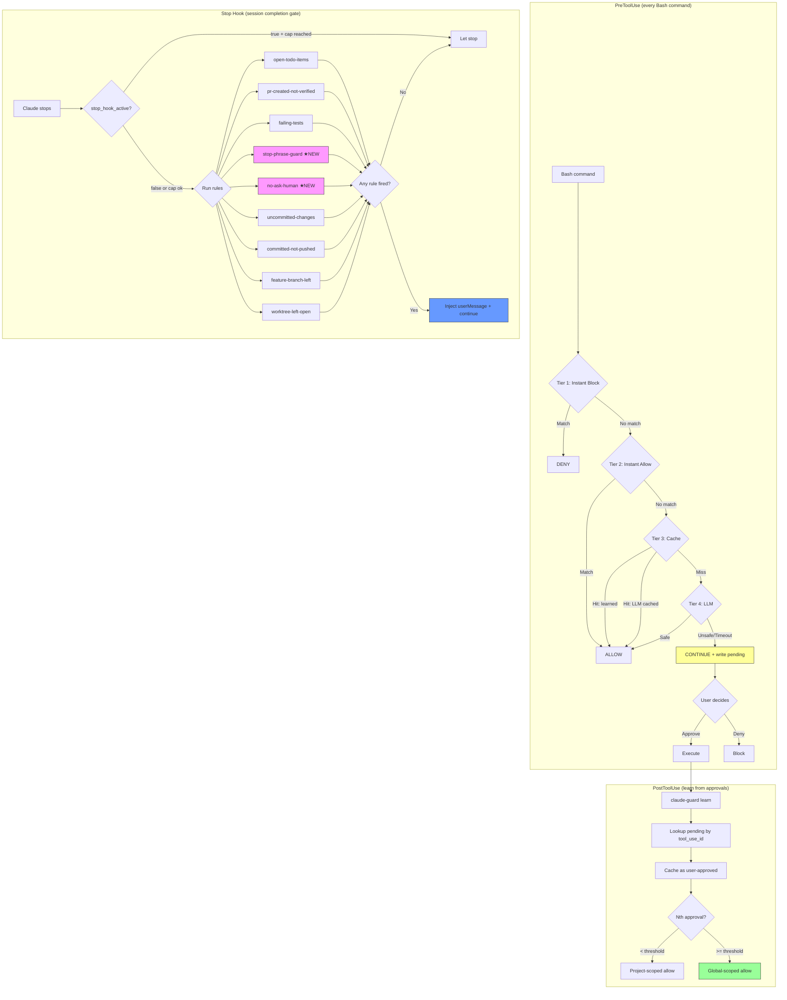

# Task: Stop Hook Tricks, Continuation Patterns & Permission Gap Fix

**Created:** 2026-04-21
**Status:** Nearly Complete (Phase 1-3 done, Phase 4 mostly done, Phase 5 done. Remaining: prompt-type hooks eval, compound command patterns)
**Context:** Deep research into community stop hook patterns, autonomous operation tricks, and investigation of why claude-guard prompts commands that should auto-continue. Combines findings from community research with identified gaps in the current guard architecture.

## Problem Summary

### 1. The Permission Prompt Gap
When claude-guard returns `continue` (tier: default), Claude Code prompts the user. Once approved, Claude Code adds the command to `permissions.allow` in settings.json — **bypassing claude-guard entirely** on the next invocation. The guard never learns from user approvals. Result: settings.json grows to 414+ entries (some with credentials), and the guard stays dumb.

The self-learning feature (commit `a438fd0`) addresses this via PostToolUse `learn` hook, but the binary isn't installed yet. After installing, need to verify the learn → promote flow works end-to-end and shrinks settings.json over time.

### 2. Stop Hook Can't Keep Sessions Going Enough
The stop hook has 9 rules and fires, but the 3-continue cap means it can only extend a session 3 times max. Some community patterns suggest smarter approaches:
- Prompt-based stop verification (LLM judges completion — no script)
- Task marker files (deterministic completion gates)
- Stop-phrase guards (catch 30+ premature stopping phrases)
- Autonomous operation patterns (from 108 hours of autonomous Claude Code)

### 3. The LLM "Unsafe" False Positives
Complex but safe multi-line commands (taufinity API polling loops, backup cp/mkdir, curl to known APIs) get classified as "unsafe" by the Gemini Flash classifier. These fall to `continue` (user prompt) despite being safe in context. The LLM needs better context or the tier 2 rules need to cover more patterns.

## Research Findings: Community Stop Hook Patterns

### Proven Patterns (worth adopting)

| Pattern | Source | How It Works | Applicable? |
|---------|--------|--------------|-------------|
| **Stop-phrase guard** | anthropics/claude-code#42796 | Regex catches 30+ premature stopping phrases across 5 categories | YES — add as new stop rule |
| **Prompt-based stop verification** | Official hooks docs | `type: "prompt"` hook — LLM judges completion, zero scripting | EVALUATE — could replace text pre-filters |
| **Task marker file** | Community pattern | `.claude/incomplete-task` file must be removed before stopping | YES — simple, deterministic |
| **No-ask-human** | 108h autonomous ops | Catches "Should I...?" phrases and reminds Claude to decide | YES — good for autonomous/subagent sessions |
| **Context monitor** | 108h autonomous ops | Graduated warnings at 40%/25%/20%/15% context remaining | EVALUATE — useful for long sessions |
| **Dual-condition exit** (Ralph) | frankbria/ralph-claude-code | Needs completion indicators AND explicit EXIT_SIGNAL | TOO HEAVY — our 3-cap is simpler |
| **Completion token** (Taskmaster) | blader/taskmaster | Demands deterministic `TASKMASTER_DONE::session_id` token | TOO RIGID — our rule system is more flexible |

### Key Technical Details

**Exit code semantics:**
- Exit 0 = proceed (JSON on stdout parsed for control)
- Exit 2 = BLOCK — for Stop hooks, prevents Claude from stopping
- Exit 1 = non-blocking error (action proceeds anyway — NOT a block)

**`stop_hook_active` flag:** When `true`, the current turn was already triggered by a previous stop hook continue. Critical for infinite loop prevention. We already handle this with our 3-layer defense (platform signal + per-session counter + rule cool-down).

**Known issue:** Stop hooks defined in SKILL.md frontmatter never fire (anthropics/claude-code#19225). All stop hook config must be in settings.json.

**Known issue:** Shell profile echo statements (in `~/.zshrc`) break JSON parsing in hooks. Hook output gets prepended with profile text.

### Patterns We Already Implement

| Pattern | Our Implementation |
|---------|-------------------|
| Test gate (block if tests fail) | `failingTestsRule` + `proposedTestNotRunRule` |
| Uncommitted changes check | `uncommittedChangesRule` (shell-verified, always runs) |
| Todo tracking | `openTodoItemsRule` |
| PR not verified | `prCreatedNotVerifiedRule` |
| Multi-layer loop prevention | 3-layer defense (platform + counter + cool-down) |
| Session continue cap | Hard cap at 3 continues per session |

## Plan

### Phase 1: Install Self-Learning + Fix Permission Gap (Priority: HIGH)

The self-learning code is already committed (`a438fd0`). Install and verify.

1. [x] Install latest claude-guard binary
   - `cd ~/Documents/code/claude-guard && make install`
   - **Verification:** `claude-guard --version` shows `a438fd0` or later

2. [x] Verify end-to-end learn cycle (doctor shows learned=1, pending=2)
   - Run a command that gets `continue` verdict
   - Approve it in Claude Code
   - Check `sqlite3 ~/.cache/claude-guard/guard.db "SELECT * FROM pending_approvals"`
   - Check that next invocation of same command auto-allows via learned cache
   - **Verification:** `claude-guard test "<same command>"` shows `tier: learned`

3. [x] Audit and clean settings.json permission bloat (410 → 185, removed 15 cred + 210 redundant)
   - Count current entries: `jq '.permissions.allow | length' ~/.claude/settings.json`
   - Identify entries that claude-guard already handles (instant_allow or learned)
   - Remove redundant entries (safe Bash commands already in tier 2)
   - Remove dangerous entries (curl with embedded credentials — 12+ entries)
   - **Verification:** Permission count drops significantly; no regressions in daily use

### Phase 2: New Stop Rules from Research (Priority: MEDIUM)

Based on community patterns that proved effective.

4. [x] Add `stopPhraseGuardRule` — catches premature stopping phrases
   Categories to match (from anthropics/claude-code#42796, adapted):
   - Ownership dodging: "not caused by my changes", "existing issue", "pre-existing"
   - Permission-seeking: "should I continue?", "want me to keep going?", "would you like me to"
   - Premature stopping: "good stopping point", "natural checkpoint", "leaving off here"
   - Known-limitation labeling: "known limitation", "future work", "out of scope for now"
   - Session-length excuses: "continue in a new session", "getting long", "pick up later"
   High confidence: false (text-only)
   - **Verification:** `claude-guard test` with synthetic transcript containing these phrases

5. [x] Add `noAskHumanRule` — catches "Should I...?" in autonomous sessions
   Only fires when `CLAUDE_GUARD_AUTONOMOUS=1` env var is set (or similar flag).
   Matches: "Should I", "Do you want me to", "Would you like me to", "Shall I"
   Reason: "Decide autonomously — you have the context. Act on the task."
   High confidence: false
   - **Verification:** env var set + synthetic transcript

6. [ ] Add `commitNotPushedRule` improvements
   Current: fires when unpushed commits exist on any branch
   Improvement: suppress on protected branches where push requires PR (check `.claude-guard.yml` for `protected_branches` list)
   - **Verification:** `go test ./internal/stop/ -run CommitNotPushed -v`

### Phase 3: LLM Classifier Improvements (Priority: HIGH)

Fix false positive "unsafe" classifications for common patterns.

7. [ ] Add tier 2 instant-allow rules for common safe compound commands
   Patterns to auto-allow without LLM:
   - `cp` to user-owned directories (backup patterns)
   - `mkdir -p` to user-owned directories
   - `curl -s` GET requests to known domains (taufinity.io, studio.taufinity.io, localhost)
   - `TOKEN=$(...) && curl` patterns where token comes from local tool
   - Poll loops: `until ... do sleep N; done` where body is read-only API calls
   Challenge: these are compound commands (pipes, `&&`, subshells) — tier 2 currently requires single anchored commands.
   Options:
   a. Extend tier 2 to support compound patterns via `.claude-guard.yml`
   b. Add a new "tier 2.5" for pattern-based compound command matching
   c. Improve LLM prompt with better context about safe API call patterns
   - **Verification:** `claude-guard test 'cp ~/.claude/CLAUDE.md ~/some/backup'` → instant_allow

8. [x] Add domain allowlist to LLM classifier context
   When the command contains curl/wget to a domain in the project's `.claude-guard.yml`:
   ```yaml
   trusted_domains:
     - studio.taufinity.io
     - localhost
     - api.github.com
   ```
   Include hint in LLM prompt: "This domain is trusted by the project config."
   - **Verification:** taufinity curl commands get `safe` from LLM instead of `unsafe`

9. [ ] Add "safe despite PUT/POST" patterns for own APIs
   The Taufinity API commands are being flagged because they use PUT/POST with Bearer tokens. But these are the user's own APIs — not exfiltration. Add pattern recognition for:
   - Tokens from `taufinity auth token` (own CLI)
   - URLs matching `trusted_domains`
   - Headers matching `X-Organization-ID` (app-specific, not generic)
   - **Verification:** taufinity API curl commands get `allow` from guard

### Phase 4: Stop Hook Enhancements (Priority: LOW)

10. [ ] Evaluate `type: "prompt"` stop hooks
    Test if Claude Code's built-in prompt-type hooks work for stop events.
    If they do, consider hybrid approach: shell-based rules for deterministic checks (git status, todo items) + prompt-based for judgment calls (did Claude actually finish?).
    Known issue: prompt hooks can trigger false positive prompt injection detection (#17804).
    - **Verification:** Add test prompt hook, observe behavior over 1 day

11. [x] Add `context-monitor` awareness (contextMonitorRule at 200+ turns)
    Detect when context window is getting full (from transcript size).
    Inject reminder: "Context is getting large. Summarize progress and key state before continuing."
    Challenge: transcript_path is provided but reading + counting tokens is expensive.
    Alternative: count transcript entries (rough proxy).
    - **Verification:** `go test ./internal/stop/ -run Context -v`

12. [x] Make continue cap configurable per-rule (MaxContinues() on StopRule interface)
    Some rules (uncommitted-changes, open-todo-items) are important enough to fire all 3 times. Others (feature-branch-left) should only fire once.
    Add `MaxContinues` to `StopRule` interface:
    ```go
    MaxContinues() int  // 0 = use global cap, N = specific cap for this rule
    ```
    - **Verification:** `go test ./internal/stop/ -run MaxContinues -v`

### Phase 5: Settings.json Hygiene (Priority: MEDIUM)

13. [x] Add `claude-guard settings audit` subcommand
    Reads `~/.claude/settings.json`, cross-references with guard's tier 2 rules and learned entries.
    Reports:
    - Entries redundant with tier 2 (already auto-allowed by guard)
    - Entries that contain credentials (SECURITY: should never be in settings.json)
    - Entries that could be replaced by learned patterns
    - One-off entries that haven't matched in 30+ days
    Output: diff that removes redundant entries + list of credential-containing entries for manual review.
    - **Verification:** `claude-guard settings audit | head -50`

14. [x] Add `claude-guard settings migrate` subcommand (--dry-run / --apply)
    Moves settings.json entries to claude-guard's learned/tier2 rules:
    - Simple Bash patterns → tier 2 allow rules (via `.claude-guard.yml`)
    - Complex patterns → learned entries in SQLite
    - Credential-containing entries → WARN + skip (human must handle)
    `--dry-run` shows what would change.
    - **Verification:** `claude-guard settings migrate --dry-run`

15. [x] Schedule periodic credential scan of settings.json (added to doctor)
    The current settings.json has 12+ curl commands with Atlassian API tokens in cleartext.
    Add check in `claude-guard doctor`:
    ```
    ✗ settings.json contains 12 entries with potential credentials
      Run: claude-guard settings audit --fix-creds
    ```
    - **Verification:** `claude-guard doctor | grep credential`

## Failure Routing

| Phase | On Failure → Route To |
|---|---|
| Phase 1 (install) | Debug build, check go version, retry |
| Phase 2 (stop rules) | Disable specific rule via config, guard continues working |
| Phase 3 (LLM improvements) | Keep current behavior (user gets prompted, approves) |
| Phase 4 (enhancements) | Optional — skip if prompt hooks don't work reliably |
| Phase 5 (settings audit) | Manual cleanup — settings.json is human-editable |

## Security Considerations

- **Credential cleanup in settings.json is urgent** — 12+ Atlassian API tokens in cleartext
- **Self-learning must respect tier 1** — learned entries can never override deterministic deny rules
- **Stop-phrase guard must not suppress legitimate questions** — "Should I continue?" is valid when the user is present; only suppress in autonomous mode
- **Domain allowlist must be project-scoped** — global trust for domains would be a security hole
- **Settings audit must never auto-delete** — always `--dry-run` first, require explicit `--apply`

## Performance Budget

| Component | Budget | Notes |
|-----------|--------|-------|
| Stop phrase regex check | < 1ms | Compiled regex, text-only |
| No-ask-human check | < 0.5ms | Simple string match |
| Settings audit | < 2s | One-time, reads settings.json + SQLite |
| Domain allowlist in LLM prompt | 0ms extra | Just appends context to existing LLM call |
| Self-learning PostToolUse | < 1ms | SQLite upsert |

## Mermaid Flow — Complete Guard + Stop Architecture



## References

- [Claude Code Hooks Reference (Official)](https://code.claude.com/docs/en/hooks)
- anthropics/claude-code#42796 — Stop-phrase guard catching 30+ premature stopping phrases
- [108 Hours of Autonomous Operation](https://dev.to/yurukusa/10-claude-code-hooks-i-collected-from-108-hours-of-autonomous-operation-now-open-source-5633)
- [Taskmaster](https://github.com/blader/taskmaster) — Completion token enforcement
- [Ralph](https://github.com/frankbria/ralph-claude-code) — Autonomous loop framework
- [claude-code-hooks-mastery](https://github.com/disler/claude-code-hooks-mastery) — All 13 hook types demonstrated
- [everything-claude-code hooks.json](https://github.com/affaan-m/everything-claude-code) — Comprehensive hook collection
- Existing plans: `2026-04-19-stop-hook-design.md`, `2026-04-19-stop-hook-impl.md`, `2026-04-21-self-learning-and-flow-metrics.md`
